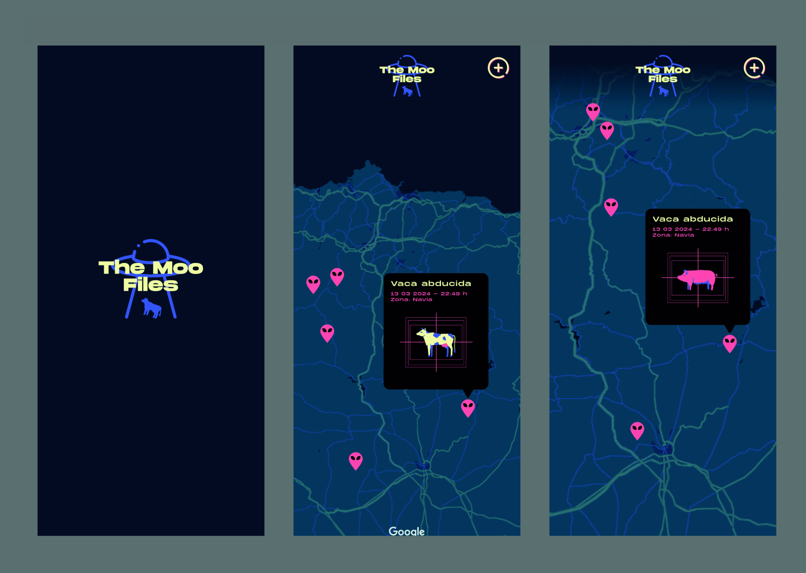

# The Moo Files App
¡Bienvenido a The Moo File, tu herramienta esencial para rastrear abducciones de ganado!

The Moo File es una aplicación diseñada para granjeros que desean mantener un registro de las abducciones de ganado en su área y colaborar con otros granjeros para identificar patrones y áreas de riesgo. Con una interfaz intuitiva y funcionalidades poderosas, nuestra aplicación hace que sea fácil para los granjeros compartir y visualizar información sobre abducciones de ganado, lo que ayuda a proteger sus amados animales.

## Funcionalidades:
* **Colaboración comunitaria:** Los granjeros pueden ver las abducciones de ganado reportadas por otros usuarios en su área, lo que les permite identificar patrones y zonas de riesgo, **utilizando chinchetas en el mapa para indicar las ubicaciones exactas.**

* **Rastreo de abducciones de ganado:** Los granjeros pueden marcar en el mapa las ubicaciones donde han ocurrido abducciones de ganado y proporcionando detalles.

## Tecnologías utilizadas:
Este proyecto ha sido desarrollado utilizando las siguientes tecnologías:

- **Frontend:** JavaScript con Svelte
- **Backend:** Python con Django

## Diseño: 
Enlace a Figma: https://www.figma.com/file/euVnkVz8bYua3VKPpGs0g3/Crazython?type=design&node-id=0%3A1&mode=design&t=li9OHdPt5V11UIuy-1

## Colaboradores:
* `@osaga-fu` Olaya Sánchez
* `@David-MarCle` David Martínez 
* `@Anadevega74` Ana Mari Fernández
* `@rgiciar` Iciar Rodríguez